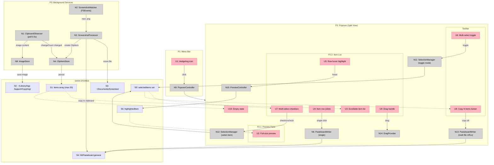

# Copyhog — Shaping Doc

## Frame

### Source

> Right now Mac OS only gives me 5 secs before saving the screenshot to the desktop, and then it takes several steps to find it, it has arbitrary names that don't allow me to identify which one it was, and my workflow is broken. I want an app that is accessible from the top bar. The app should let me see recent screenshots and copied items in general (could be text). It should have a browsable digest to select for rapid copy/paste, as well as a preview of the item.

### Problem

- macOS screenshot thumbnail disappears after ~5 seconds — miss it and you're hunting on desktop
- Screenshots save with names like `Screenshot 2026-02-20 at 3.42.15 PM.png` — impossible to identify
- Getting a screenshot back into another app requires: find file → open → copy → switch back → paste
- The system clipboard only holds ONE item — previous copies are lost forever
- No unified view of "things I've recently captured" (screenshots + text + images)

### Outcome

- Screenshots and clipboard items are automatically captured and persisted in a browsable history
- Any captured item can be re-pasted into any app within seconds
- The tool is always accessible but never in the way

---

## Requirements (R)

| ID | Requirement | Status |
|----|-------------|--------|
| R0 | Automatically capture clipboard items (text + images) and screenshots into a persistent history | Core goal |
| R1 | Run as a macOS menu bar app with split-view popover (~360×480px): preview top, list bottom | Must-have |
| R2 | Accessible via menu bar click | Must-have |
| R3 | Observer mode — watch system clipboard + screenshot directory, don't replace native shortcuts | Must-have |
| R3.1 | When a screenshot is detected, automatically copy it to the system clipboard | Must-have |
| R3.2 | Move/save all detected screenshots to `~/Documents/Screenies/` | Must-have |
| R4 | Show browsable list of recent items with visual previews (thumbnails for images, text snippets for text) | Must-have |
| R5 | Single-select: clicking an item copies it to system clipboard for pasting | Must-have |
| R6 | Multi-select images: write multiple images as file URL references to pasteboard for batch paste | Must-have |
| R7 | Drag-and-drop: drag selected items from Copyhog into target apps | Nice-to-have |
| R8 | Retain last 20 items, auto-purge oldest when limit exceeded | Must-have |
| R9 | Built with Swift + SwiftUI, native macOS app | Must-have |

---

## A: Menu Bar Observer with Local Image Store

| Part | Mechanism | Flag |
|------|-----------|:----:|
| **A1** | **Clipboard observer** — Poll `NSPasteboard.general.changeCount` on a 0.5s timer. On change, read content (string or image), create ClipItem, persist to store | |
| **A2** | **Screenshot watcher** — `DispatchSource.makeFileSystemObjectSource` on screenshot directory. Detect new `.png` files | |
| **A3** | **Screenshot processor** — On new screenshot: (a) move file to `~/Documents/Screenies/`, (b) copy image to system clipboard, (c) create ClipItem | |
| **A4** | **Local store** — `@Published items: [ClipItem]` capped at 20. Images saved to `~/Library/Application Support/Copyhog/`. Oldest purged when full | |
| **A5** | **Menu bar + popover** — `MenuBarExtra` with hedgehog silhouette icon. Click opens SwiftUI popover (360×480) | |
| **A6** | **Split-view UI** — Preview pane (top): full-size image or full text of highlighted item. Item list (bottom): scrollable `LazyVStack` of rows with thumbnails/snippets + timestamps | |
| **A7** | **Single-select paste** — Click item row → `PasteboardWriter` writes item to `NSPasteboard.general` | |
| **A8** | **Multi-select batch paste** — Toggle multi-select mode (Cmd+Click or toggle button). "Copy N items" button writes selected image file URLs as `[NSPasteboardItem]` to pasteboard | |
| **A9** | **Drag-out support** — Items conform to `Transferable` / `NSItemProvider`. Drag one or many from popover into target apps | |

---

## Fit Check: R × A

| Req | Requirement | Status | A |
|-----|-------------|--------|---|
| R0 | Automatically capture clipboard items (text + images) and screenshots into a persistent history | Core goal | ✅ |
| R1 | Run as a macOS menu bar app with split-view popover (~360×480px): preview top, list bottom | Must-have | ✅ |
| R2 | Accessible via menu bar click | Must-have | ✅ |
| R3 | Observer mode — watch system clipboard + screenshot directory, don't replace native shortcuts | Must-have | ✅ |
| R3.1 | When a screenshot is detected, automatically copy it to the system clipboard | Must-have | ✅ |
| R3.2 | Move/save all detected screenshots to `~/Documents/Screenies/` | Must-have | ✅ |
| R4 | Show browsable list of recent items with visual previews (thumbnails for images, text snippets for text) | Must-have | ✅ |
| R5 | Single-select: clicking an item copies it to system clipboard for pasting | Must-have | ✅ |
| R6 | Multi-select images: write multiple images as file URL references to pasteboard for batch paste | Must-have | ✅ |
| R7 | Drag-and-drop: drag selected items from Copyhog into target apps | Nice-to-have | ✅ |
| R8 | Retain last 20 items, auto-purge oldest when limit exceeded | Must-have | ✅ |
| R9 | Built with Swift + SwiftUI, native macOS app | Must-have | ✅ |

---

## Detail A: Breadboard

### Places

| # | Place | Description |
|---|-------|-------------|
| P1 | Menu Bar | Persistent hedgehog icon in macOS menu bar |
| P2 | Popover (Split View) | Main UI panel (~360×480px) — preview top, item list bottom |
| P2.1 | Preview Pane | Upper section: full-size image or full text of highlighted item |
| P2.2 | Item List | Lower section: scrollable list of captured items |
| P3 | Background Services | Always-running observers (no UI — system-level processes) |

### UI Affordances

| # | Place | Component | Affordance | Control | Wires Out | Returns To |
|---|-------|-----------|------------|---------|-----------|------------|
| U1 | P1 | MenuBarExtra | Hedgehog icon (template image) | click | → N9 | — |
| U2 | P2.1 | PreviewPane | Full-size image preview (fit-to-width) or full text content | render | — | — |
| U3 | P2.2 | ItemList | Scrollable LazyVStack of item rows | render | — | — |
| U4 | P2.2 | ItemRow | Item row: 64×64 thumbnail OR 2-line text snippet + relative timestamp | click | → N6 | — |
| U5 | P2.2 | ItemRow | Highlight/hover state on row | hover | → N10 | — |
| U6 | P2 | Toolbar | Multi-select toggle button | click | → N11 | — |
| U7 | P2.2 | ItemRow | Multi-select checkbox (visible when multi-select active) | click | → N12 | — |
| U8 | P2 | Toolbar | "Copy N items" button (visible when selections exist) | click | → N13 | — |
| U9 | P2.2 | ItemRow | Drag handle / draggable row | drag | → N14 | — |
| U10 | P2 | EmptyState | "No items yet" message + hint to take a screenshot | render | — | — |

### Code Affordances

| # | Place | Component | Affordance | Control | Wires Out | Returns To |
|---|-------|-----------|------------|---------|-----------|------------|
| N1 | P3 | ClipboardObserver | Poll `NSPasteboard.general.changeCount` every 0.5s | timer | → N4, → N8 | — |
| N2 | P3 | ScreenshotWatcher | `DispatchSource.makeFileSystemObjectSource` on screenshot dir | observe | → N3 | — |
| N3 | P3 | ScreenshotProcessor | Move .png to `~/Documents/Screenies/`, copy to clipboard, create ClipItem | call | → N4, → N6, → S3 | — |
| N4 | P3 | ClipItemStore | `@Published items: [ClipItem]` — append new, purge if >20 | write | → S1 | → U3, → U10 |
| N5 | — | ClipItem | Model: id, type (.text/.image), content, thumbnailData, filePath, timestamp | — | — | — |
| N6 | P2 | PasteboardWriter | Write single item to `NSPasteboard.general` (text or image) | call | → S4 | — |
| N8 | P3 | ImageStore | Save copied images to `~/Library/Application Support/Copyhog/` | call | → S2 | — |
| N9 | P1 | PopoverController | Toggle popover visibility | call | → P2 | — |
| N10 | P2 | PreviewController | Set highlighted item → update preview pane | call | — | → U2 |
| N11 | P2 | SelectionManager | Toggle `isMultiSelectActive` bool | call | — | → U7, → U8 |
| N12 | P2 | SelectionManager | Add/remove item from `selectedItems` set | call | — | → U7, → U8 |
| N13 | P2 | PasteboardWriter | Write selected image file URLs as `[NSPasteboardItem]` to pasteboard | call | → S4 | — |
| N14 | P2 | DragProvider | Conform items to `Transferable` / `NSItemProvider` for drag-out | call | — | — |

### Data Stores

| # | Place | Store | Description |
|---|-------|-------|-------------|
| S1 | P3 | `ClipItemStore.items` | Array of ClipItem (max 20), persisted to disk |
| S2 | — | `~/Library/Application Support/Copyhog/` | File system: saved copied images (not screenshots) |
| S3 | — | `~/Documents/Screenies/` | File system: organized screenshots moved from desktop |
| S4 | — | `NSPasteboard.general` | System clipboard (external) |
| S5 | P2 | `SelectionManager.selectedItems` | Set of selected ClipItem IDs for multi-select |
| S6 | P2 | `PreviewController.highlightedItem` | Currently highlighted ClipItem for preview |

### Mermaid Diagram

**Legend:**
- **Pink nodes (U)** = UI affordances (things users see/interact with)
- **Grey nodes (N)** = Code affordances (handlers, observers, services)
- **Lavender nodes (S)** = Data stores (state, file system, system clipboard)
- **Solid lines** = Wires Out (calls, triggers, writes)
- **Dashed lines** = Returns To (data reads, rendering feeds)
